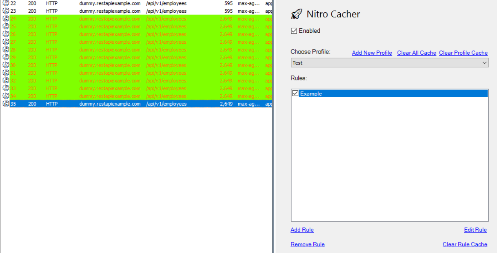

# Nitro Cacher
🚀[Fiddler](https://www.telerik.com/fiddler) add-on to cache API responses based on rules. 

Useful while developing in projects that
 * Use rate-limited APIs.
 * Use a lot of API calls which gets cached in-memory/in-process and gets invalidated during recompiles.
 
 An out-proc/disk cache baked into the application is probably the right solution to these problems. 
 But chances are that you are already using Fiddler for debugging API calls, and this add-on provides a cheap and re-usable alternative 
 for caching API calls in your development machine without needing you to change a single line of your project's code.
 
 ## Features
  * Match URL using various criteria: Exact, Partial, Regex, Host Name. 
  * Options to mark sessions served from cache in UI with colors, or hide it.
  * Enable/Disable the cache for individual rules or as a whole.
  * Group rules into profiles, and switch between profiles at any time.
  * Reset cache per rule, per profile or as a whole.
 
 ## Installation
 
 Download the NitroCacher.dll from releases, and 
 * Copy to \Documents\Fiddler2\Scripts to make the extension available to the current user.
 * Copy to \Program Files\Fiddler2\Scripts OR AppData\Local\Programs\Fiddler\Scripts (this path depends on how fiddler was installed) to install for all users
 
 Restart fiddler, and navigate to `Nitro Cacher` tab for configuring rules.
 
 ## Configuration Screens
 #### Main Screen
 
 
 
  #### Rule configuration
 
 
 ## Contribute
 Bug reports and Pull Requests are welcome. The add-on is not thouroghly tested, and could use some improvements in terms of code and features.
 Few features that are planned: 
 [] An installer
 [] Persistant cache
 [] Filter requests further based on HTTP verbs
 [] Expiration and Cache size limit for the cache.
 [] Display Summary of cache (Number of items, memeory used etc.)
 
 ### Developing
 * Checkout the code
 * Open NitroCacher.sln in Visual Studio
 * Edit the Post Build event to point to <fiddler installation path\Scripts> where the add-on should be copied to. 
 * Update references to fiddler.exe with the correct paths.
 * Build.
 * Launch fiddler to test the add-on. Every recompilation needs fiddler to be closed and opned again to reload the add-on.
 * Attach Visual Studio to the Fiddler.exe process for debugging.
